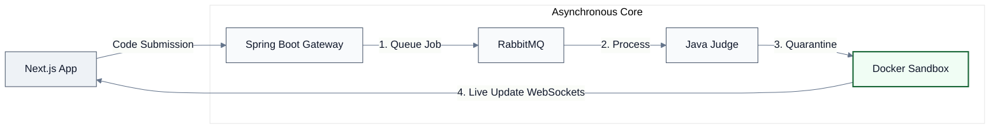

# Coduelle - Real-Time Competitive Coding Arena


**Coduelle** is a mobile-first, full-stack real-time competitive coding application. Designed to transition standard asynchronous coding practice into a high-intensity 1v1 duel arena, it pairs an elastic mobile web client with an isolated, multi-tier asynchronous evaluation engine.

**[Live Demo]()** | **[API Documentation]()**

---

## Project Overview

### The Challenge

Safely executing user-submitted programming code in real time presents critical systems and infrastructure vulnerabilities:

- An unconstrained submission containing infinite loops or excessive memory allocation can choke host machine resources, freezing the server for all active users and leading to resource starvation.
- Untrusted execution parameters open vectors for file-system manipulation or network attacks if run directly inside native app threads.
- Pulling execution updates continuously through REST polling forces massive system overhead, ruining fast-paced matchmaking elements.

### Project Vision

Our goal is to build a bulletproof competitive arena by:

1. **Quarantine Isolation:** Offloading code processing entirely into programmatic, network-muted, resource-capped Docker sandboxes managed via Java background workers.
2. **Decoupled Architecture:** Buffering peak traffic spikes safely through an intermediate RabbitMQ message broker to keep web response latency flat.
3. **Bi-Directional Streaming:** Utilizing full-duplex WebSockets (STOMP) to push real-time test verification progress between competing duelist views instantly.

---

## Key Features

- A fluid mobile web layout featuring fixed problem definitions on top and a responsive monospace editor input filling the lower touchscreen canvas.
- Instant acknowledgment response on submission clicks while the code executes in safe back-end processing layers.
- Dual progress bars detailing exactly how many hidden test checks your opponent has passed in real time.
- Live ranking profiles structured via high-speed memory caches to enable immediate score changes with sub-millisecond lookups.

---

## Tech Stack

| Layer                   | Technology                   | Key Features                                                                              |
| :---------------------- | :--------------------------- | :---------------------------------------------------------------------------------------- |
| **Frontend**            | **Next.js 15 (TypeScript)**  | Mobile-first viewport optimization, Tailwind CSS, Framer Motion transitions               |
| **Real-Time Gateway**   | **Spring Boot & WebSockets** | Java 21 Virtual Threads (Project Loom), STOMP event distribution protocols                |
| **Asynchronous Broker** | **RabbitMQ**                 | Decoupled task exchange topologies routing user code to validation targets                |
| **Sandbox Engine**      | **Java Worker + Docker API** | Programmatic runtime management using strict CPU and Memory boundaries (`--network none`) |
| **Database**            | **PostgreSQL 17**            | Relational data persistence mappings for problem datasets and historical matches          |
| **Caching & Scoring**   | **Redis**                    | High-performance user tracking utilizing memory-efficient Redis Sorted Sets (ZSET)        |

---

## Quick Start

Ensure you have **Docker 27** and **Docker Compose** installed.

1.  **Clone & Enter:**

    ```bash
    git clone [https://github.com/your-username/coduelle](https://github.com/your-username/coduelle) && cd coduelle
    ```

2.  **Environment Setup:** Create a `.env` file in the root directory:

    ```env
    POSTGRES_PASSWORD=your_secure_db_password
    JWT_SECRET=your_jwt_signing_token
    RABBITMQ_DEFAULT_PASS=your_queue_password
    ```

3.  **Spin up the Stack:**

    ```bash
    docker-compose up --build
    ```

    - Mobile Web Frontend: `http://localhost:3000`
    - Gateway Service API: `http://localhost:8080`
    - RabbitMQ Dashboard: `http://localhost:15672`

---

## System Architecture



---

## Developed By

| Name                  | Role          | Links                                                                                                |
| :-------------------- | :------------ | :--------------------------------------------------------------------------------------------------- |
| **Pratyusha Dasari**  | Web Developer | [GitHub](https://github.com/pratyusha-ds) / [LinkedIn](https://www.linkedin.com/in/pratyusha-ds/)    |
| **Banto-Laczi Klára** | Web Developer | [GitHub](https://github.com/bantoklara) / [LinkedIn](https://www.linkedin.com/in/banto-laczi-klara/) |

## License

This project is licensed under the MIT License - see the [LICENSE](https://opensource.org/license/mit/) file for details.
